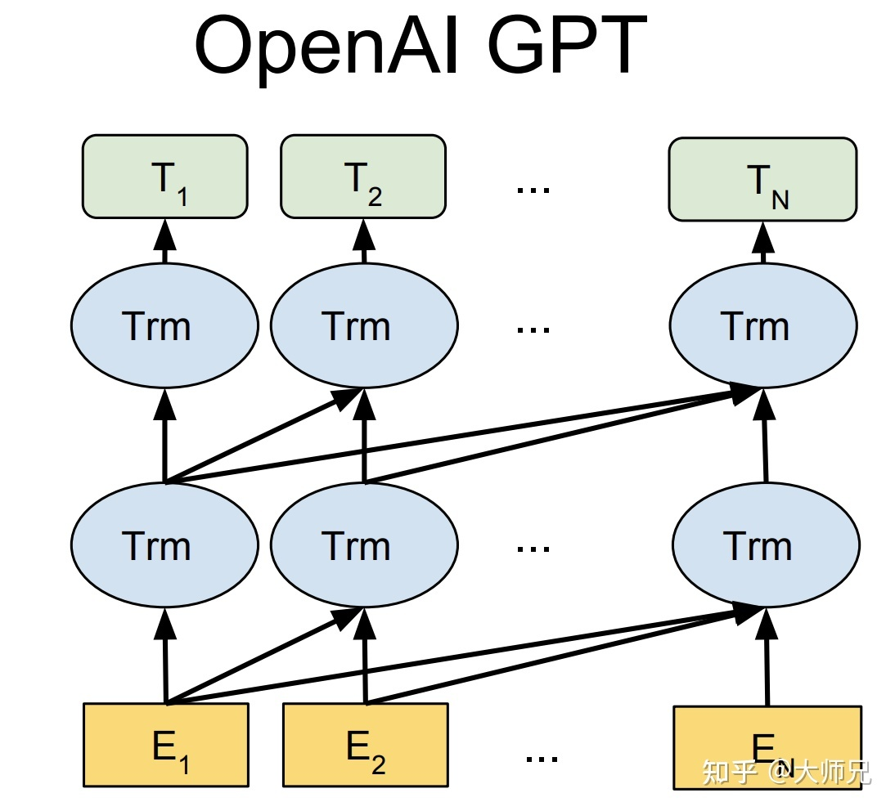

# NLP_Practice2023

随着ChatGPT和大模型席卷NLP领域，基于Transformer的生成式模型成为了每个NLP研究者必备的基础知识。本练习致力于从零构建一个基于Transformer的诗歌生成模型，从而熟悉Transformer的结构以及生成式模型的架构。

**数据集**：https://github.com/THUNLP-AIPoet/Datasets/tree/master/CCPC

**模型结构**：仿照GPT1的架构，不需要加载GPT预训练参数，层数、隐藏层大小等参数可以根据你的硬件资源、实验效果等调整：

**格式**：

`` 标题: <Title> 关键词: <keyword1> <keyword2> 诗歌: <line1>|<line2>|<line3>|<line4> ``

**基础要求**：
1. 基于torch.nn.TransformerDecoder实现模型；
2. 以perplexity为验证集/测试集的评价指标；

**进阶要求**：
1. 基于torch.nn.MultiheadAttention和torch.nn.Linear实现模型；
2. 手动实现beam search（或者其他的解码算法也可以）；
3. 输入标题和关键词，输出诗歌，以BLEU值为验证集/测试集的评价指标；

**提交结果**：
1. 源代码；
2. 测试结果截图；
3. 简短的实验报告；
