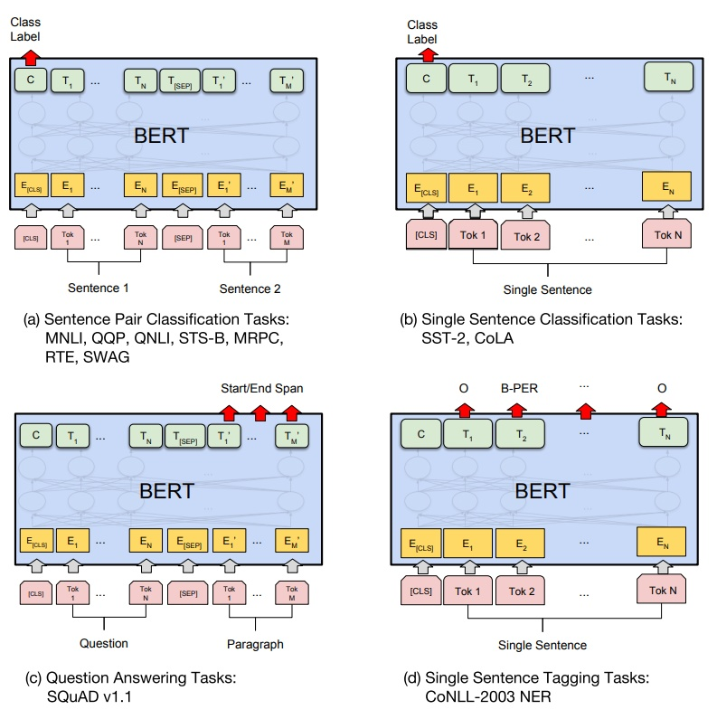

# NLP_Practice2023

### 任务一：基于BERT的文本分类

BERT可以用来进行分类、序列标注、匹配等多种自然语言理解任务。本任务需要你实现一个基于BERT的文本分类模型，从而对基于深度学习和预训练模型的自然语言处理有一个初步的认识。

**数据集**：[Large Movie Review Dataset](http://ai.stanford.edu/~amaas/data/sentiment/) 

**预训练模型**：[BERT-Tiny](https://huggingface.co/prajjwal1/bert-tiny) 是BERT的缩小版本，本机也能跑得动

**编程框架**：Pytorch + [Huggingface-transformers](https://huggingface.co/docs/transformers/index)

**参考论文**：BERT: Pre-training of Deep Bidirectional Transformers for Language Understanding，https://arxiv.org/abs/1810.04805

**模型结构**：下面的图片中的左上角，是BERT用于文本分类时的架构。由于这里使用的是预训练模型，所以实际上只需要你构建输入和输出；

 

**评价指标**：精确值（accuracy）

### 任务二：基于Transformer的文本生成

随着ChatGPT和大模型席卷NLP领域，基于Transformer的文本生成模型成为了每个NLP研究者必备的基础知识。本任务需要你从零构建一个基于Transformer的诗歌生成模型，从而熟悉Transformer的结构以及文本生成的过程。

**数据集**：https://github.com/THUNLP-AIPoet/Datasets/tree/master/CCPC

**模型结构**：仿照GPT1的架构，不需要加载GPT预训练参数，Transformer层数、隐藏层大小等超惨可以根据你的硬件资源、实验效果等调整：


**格式**：

```
输入： 标题: <Title> 关键词: <keyword1> <keyword2> 诗歌: 
输出： <line1>|<line2>|<line3>|<line4> 
````
**评价指标**：困惑度（perplexity）

## 要求：
1. 可以先参考别人的代码，运行实现，但是最终提交的代码一定是自己手写的；
2. 仅使用训练集中的数据进行训练，禁止使用验证集/测试集训练；
3. 对于任务二，尽可能基于更加底层的函数实现该模型，比如[torch.nn.MultiheadAttention](https://pytorch.org/docs/stable/generated/torch.nn.MultiheadAttention.html)；

## 提交结果：
1. 源代码：不需要打包数据集，；
2. 实验报告：README.md形式，包含以下内容：
    1. 超参数设置（学习率，batch size、层数、词表大小、训练轮数等等）；
    2. 在验证集和测试集上的结果；
    3. 对于任务二，要提交测试集中前五首诗的生成结果；
    4. 实验过程中的发现和心得，或者其他任何你想要分享的内容；
