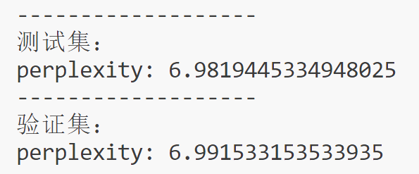
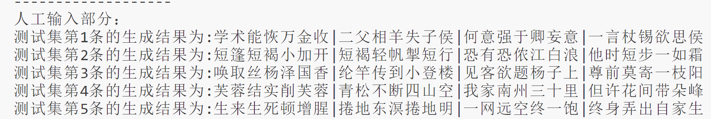
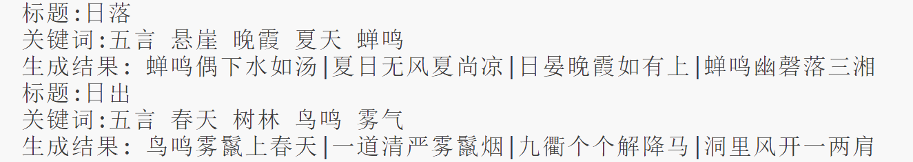
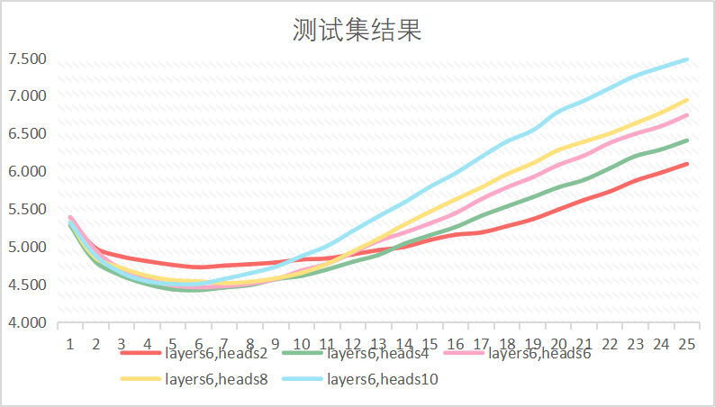
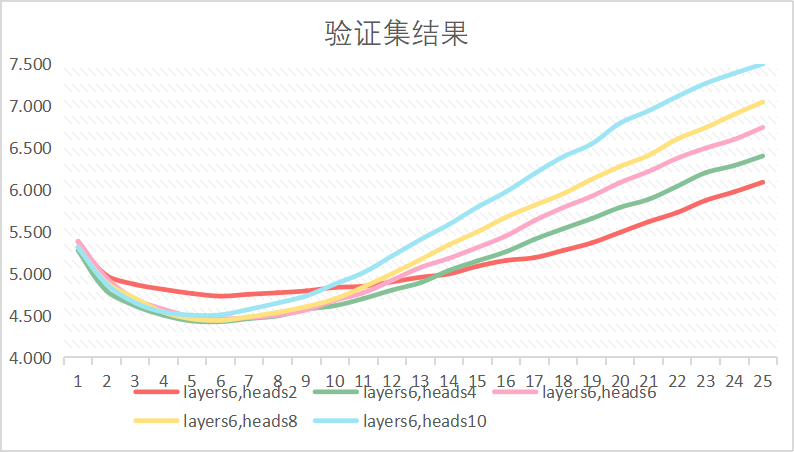
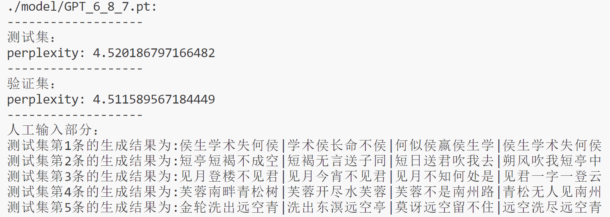
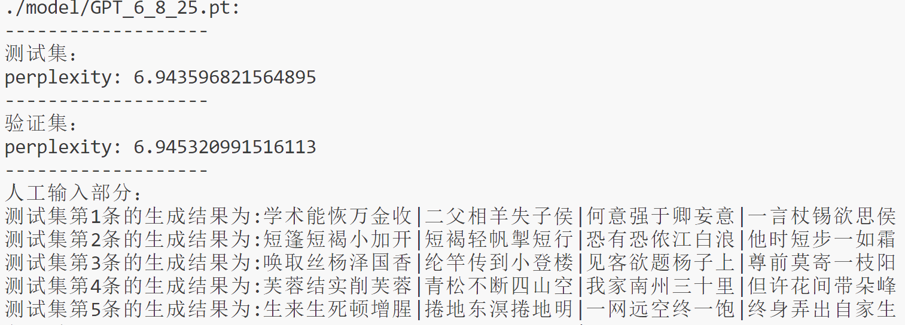

# 入门任务1

## 运行步骤

1. ```shell
   python make_vocabs.py #构建词表、将训练数据、测试数据写入json
   python train.py  #训练模型
   python evaluate.py #在测试集上验证、人工输入
   ```

   

## 超参数设置

如config.py中的Config类所示：

|     超参数     | 超参数的值 |
| :------------: | :--------: |
|    max_len     |    500     |
| embedding_size |    768     |
|    ffn_size    |    2048    |
|   num_layers   |     6      |
|   num_heads    |     8      |
|     k_size     |     64     |
|    dropout     |    0.1     |
|   bacth_size   |     64     |
|     epoch      |     25     |
| learning_rate  |    1e-4    |
|    max_norm    |     1      |

## 测试结果



## 结果样例


测试集中前五首的生成结果如上图所示；



人工测试结果如上图所示；

## 其他结果

**固定解码器层数为6，训练轮数为25，修改多头注意力头数，查看测试集、验证集上的loss变化**

测试集：



验证集：



epoch7：



epoch25：



1.就loss极小值而言，heads数量选取4~8更好；

2.在训练后期（越过loss极小值、随着epoch增大），heads数量越多，loss可能越大；

3.即使loss在训练轮数5~6左右时最小，但是生成的诗歌重复较多，应该继续训练；

## 小结

1.在没有参考之前，自己从头开始实现有些迷茫，即使根据transformer源码搭建其大致框架，但是也是”缺斤少两“的，难以运行；在有了参考之后，实现起来不再那么困难；

2.在实现模型的子结构时，由于没有相关经验，遇到有很多不懂的方法，如其中使用到的np.triu()、tensor.squeeze()等，经过查找，了解了其含义和用法。随后，又手动实现各个结构，加深了对其的印象；

3.尝试使用alive-progress（可视化工具，但由于影响模型输入[不是词表的问题]，后来删除）、SwiGLU激活函数（虽然收敛比RELU快，但收敛值较高、占据空间较大，当然可能和自身实现有关；最终使用的RELU）；

4.简单尝试了多卡训练但是失败了（当时还在模型结构实现的步骤），但是推测解决了训练数据、模型等的所在位置就可以了；

5.尽管在测试集和验证集上的loss在训练初期达到极小值，但是就诗歌生成效果而言，还是应该选取训练后期的模型生成诗歌；
