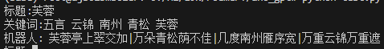

# GPT架构的诗歌生成模型

## 引用代码

[主体部分](https://blog.csdn.net/weixin_44599230/article/details/)

[mask修改](https://github.com/liucongg/GPT2-NewsTitle/blob/main/model.py)

## 运行说明

make_data.py用于构造数据集；train.py训练模型；test.py测试模型；eval.py计算困惑度。路径需要自行修改。

## 缺陷

超参数部分在gpt_model.py中。当前模型无法很好地根据提示生成五言或七言，不知是训练问题还是模型大小问题。

