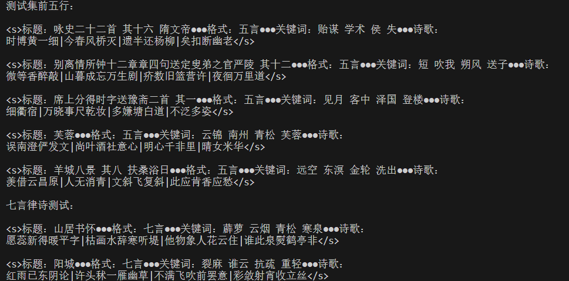

# README

- 参数设置

| 中文名称   | 英文名称                         | 数值 |
| :--------- | :------------------------------- | :--- |
| 批次大小   | batch_size                       | 64   |
| 块大小     | block_size（max context length） | 256  |
| 学习率     | learning_rate                    | 2e-5 |
| 嵌入维度   | n_embd                           | 64   |
| 头的数量   | n_head                           | 8    |
| 层数       | n_layer                          | 10   |
| 丢弃率     | dropout                          | 0.1  |
| 训练周期数 | epochs                           | 10   |
| 词表大小   | vocab_size                       | 7268 |

- 在验证集和测试集上的perplexity

$perplexity=e^{mean(loss)}$

| 数据集 | perplexity |
| :----- | :--------- |
| 验证集 | 853.09     |
| 测试集 | 877.60     |

- 测试集中前五首诗的生成结果

- 发现和心得

一开始尝试预训练的方式，将训练集拼接后按照block_size进行叠加，但因为预训练预料太少，并且这种数据更适合SFT阶段，所以效果较差。

后面将训练集的每一句话作为一条数据，并且在计算损失时只计算具体诗句的损失，提升了模型的性能。

因事情较多，代码整体不是很优雅。

后续优化方向：基于大量通用数据集进行预训练，然后利用诗歌训练集进行SFT。