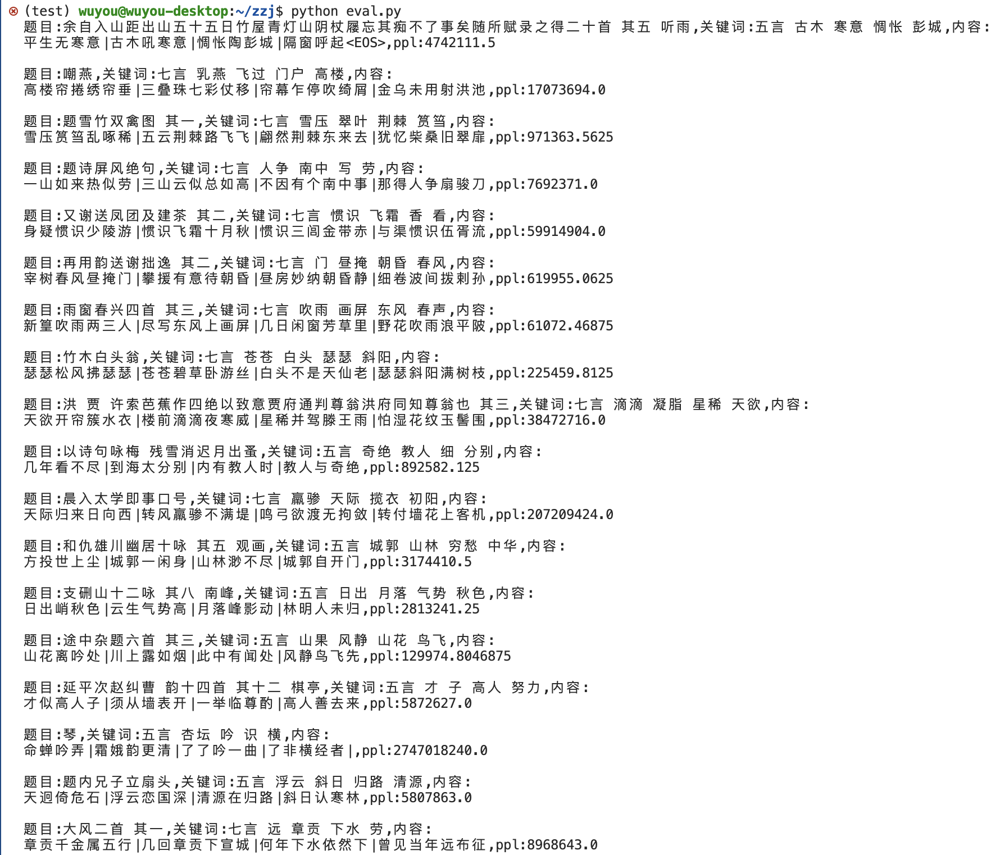

# README

超参数：

| param | value |
| --- | --- |
| d_model | 768 |
| n_head | 8 |
| num_layers | 12 |
| batch_size | 32 |
| lr | 0.0001 |

诗歌生成效果如下（测试集上数据）：

目前存在的问题是诗歌内容虽然生成的还算正常，但是PPL值过大，不知道哪里出现了问题，如果同学在参考过程中发现了，可以联系我。
