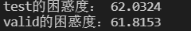
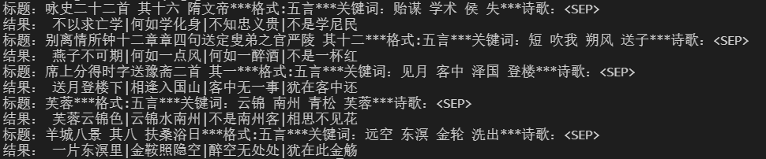
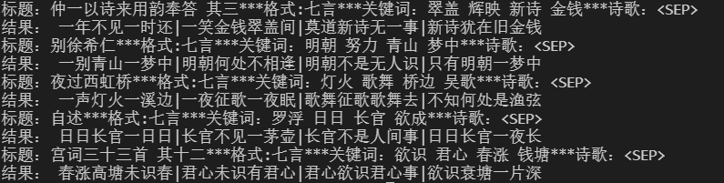

# 实验报告

### 参数设置
| 参数 | 数值 |	
| ---- | ----|	
|  batch_size  |  128 |
|max_len| 256|
| learning_rate| 1e-4|
| epochs | 10|
| vocab_size| 7274|
|seq_len| 512|
| d_model | 768|
| d_ff| 2048|
| d_k, d_v | 64|
| n_layers | 6|
| n_heads| 8|
|clip| 1|

### 模型评估	
test 和 valid 数据集上的ppl

### 测试结果    
* 五言部分

* 七言部分

###  心得体会
* 一个小小的代码失误都能给模型的结果造成很大的影响；
* 了解了一个生成任务的实现架构，主要包括数据处理，模型构建，模型预测和评估，当然还有很大一部分是代码调试；
* 损失计算需要只计算生成结果的损失，虽然是直接把整个句子都扔进了模型里；

