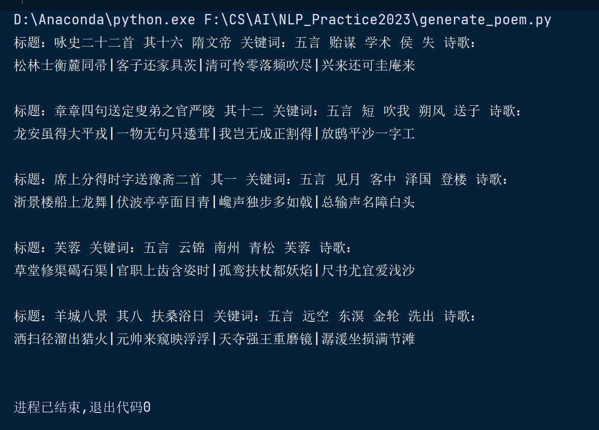

# README

1. 超参数设置

| 中文名称            | 英文名称        | 数值 |
| :------------------ | :-------------- | :--- |
| 批次大小            | batch_size      | 32   |
| 前30个epoch的学习率 | learning_rate_1 | 1e-4 |
| 后10个epoch的学习率 | learning_rate_2 | 1e-5 |
| 嵌入的维度          | d_model         | 768  |
| 头的数量            | n_head          | 4    |
| 层数                | n_layer         | 12   |
| 丢弃率              | dropout         | 0.1  |
| 训练周期数          | epochs          | 40   |
| 词表大小            | vocab_size      | 7268 |

2. 在验证集和测试集上的perplexity

| 数据集 | perplexity |
| :----- | :--------- |
| 验证集 | 26323.7656 |
| 测试集 | 26609.3828 |

3. 测试集中前五首诗的生成结果

4. 发现和心得

- 直接使用torch.nn.MultiheadAttention会导致loss为nan，只能手动实现。
- 本模型中，sin-cos位置编码比可学习的位置编码效果要好，随机权重初始化比xavier权重初始化效果要好。
- 可能是因为训练集数据分布不均，七言诗远远多于五言诗，本模型架构又比较简单，所以当前模型无法很好地根据提示生成对应五言诗或七言诗，困惑度也很大。
- 发现输入过长或过短时输出效果都不太好，所以在测试时手动调整了一下输入的长度。输入长度过短时在前面加 <bos>填充，输出长度过长时删去一部分标题。
- 前30个epoch发现loss有增长的趋势，于是调小学习率又训练了10个epoch。

